# Vue Practice Demo
## 변경 요약

### 목표
- Vue2 예제 코드를 Vue3 표준 문법으로 전환
- 기존 기능 및 출력 화면은 완전히 동일하게 유지
- 코드 구조를 단순화하고 최신 Vue 권장 방식으로 개선

## 코드 실행 화면

  
클릭해서 코드 실행 화면 전체 보기

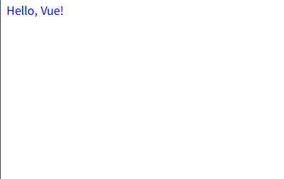  
  
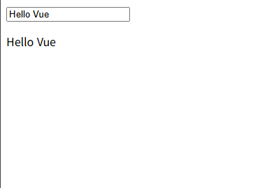  
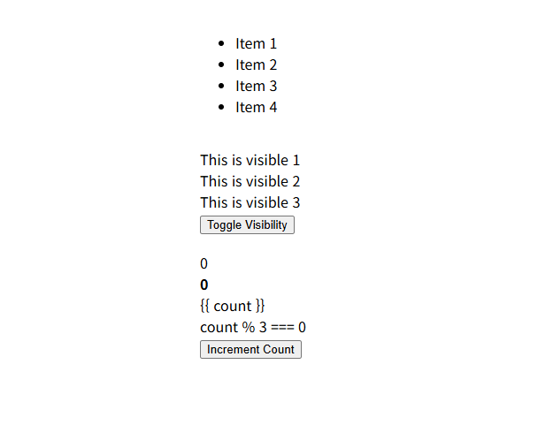  
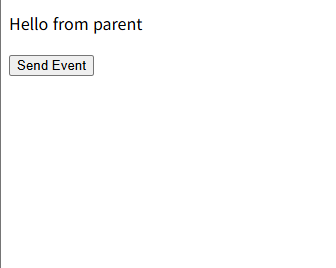  
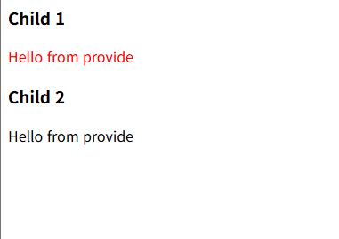  
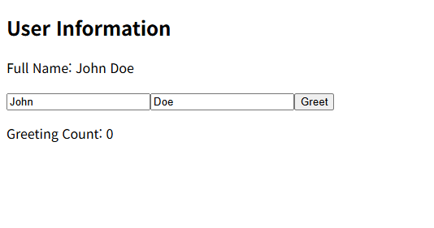  
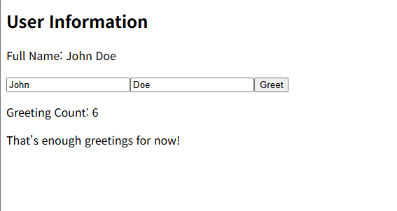  
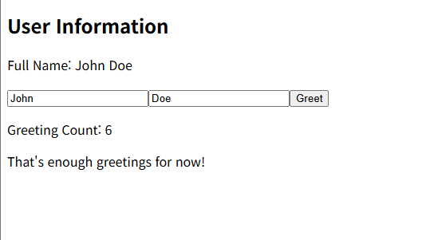  
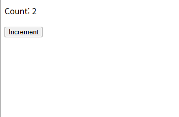  
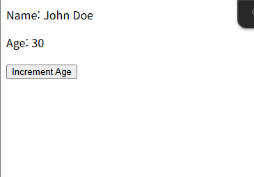  
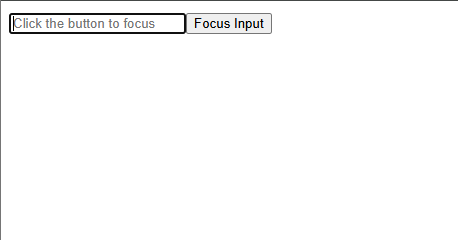

### 코드 주요 변경 사항

#### 1️⃣ Vue 인스턴스 생성 방식
- `new Vue({...}).$mount('#app')` → `createApp(App).mount('#app')` 로 변경
- Vue3의 **createApp API**를 사용하여 앱 초기화

#### 2️⃣ `<script setup>` 문법 도입
- 모든 컴포넌트에서 `export default { ... }` 제거
- `<script setup>` 구문으로 전환해 불필요한 코드 감소
- 자동 변수 노출로 `this` 키워드 제거 및 단순화

#### 3️⃣ Composition API 적용
- Vue2의 `data`, `methods`, `computed`, `watch` 옵션 제거
- Vue3의 **`ref`**, **`reactive`**, **`computed`**, **`watch`**, **`onMounted`** 등으로 대체
- 반응형 상태 및 라이프사이클 로직을 명시적 함수 기반으로 재작성

#### 4️⃣ props / emit 구조 개선
- `props` → `defineProps()`
- `$emit()` → `defineEmits()`
- 자식 ↔ 부모 간 데이터 전달 구조 단순화

#### 5️⃣ 라이프사이클 훅 변경
- Vue2 훅 → Vue3 대응 훅으로 변경
    - `beforeCreate`, `created` → (Composition API 내부 실행)
    - `beforeMount`, `mounted` → `onBeforeMount`, `onMounted`
    - `beforeUpdate`, `updated` → `onBeforeUpdate`, `onUpdated`
    - `beforeDestroy`, `destroyed` → `onBeforeUnmount`, `onUnmounted`

#### 6️⃣ 반응형 시스템 개선
- 원시 타입 → `ref()`
- 객체/배열 → `reactive()`
- `ref`와 `reactive`를 병행 사용하여 Vue3의 reactivity 구조 완전 반영

#### 7️⃣ 디렉티브 호환성 확인
- `v-if`, `v-for`, `v-show`, `v-bind`, `v-on`, `v-model`, `v-html`, `v-text`, `v-pre` 등  
  Vue2 문법이 그대로 작동하도록 검증 완료
- 추가 로직 없이 Vue3에서도 동일한 UI 동작 확인

#### 8️⃣ 코드 스타일 및 구조 정리
- 중복 import 및 불필요한 `this` 참조 제거
- 컴포넌트명은 `defineOptions({ name: '...' })`으로 명시
- 파일 간 구조를 통일해 일관성 확보

